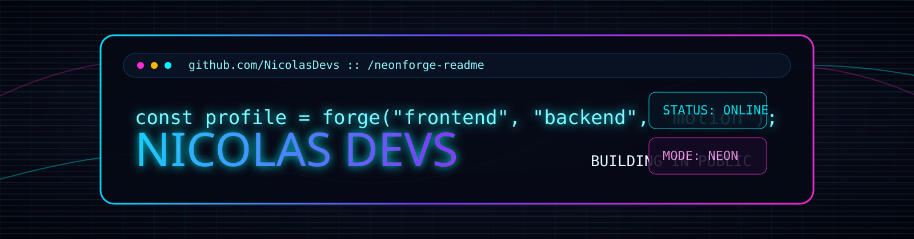
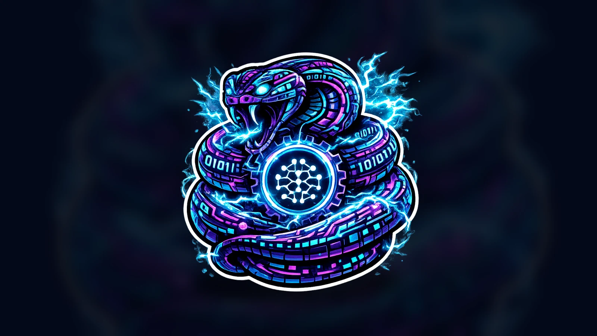
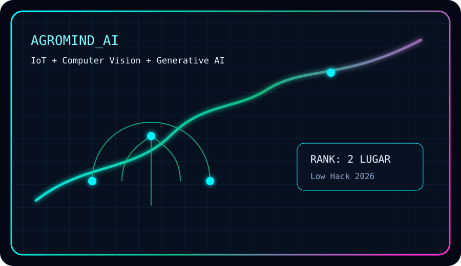
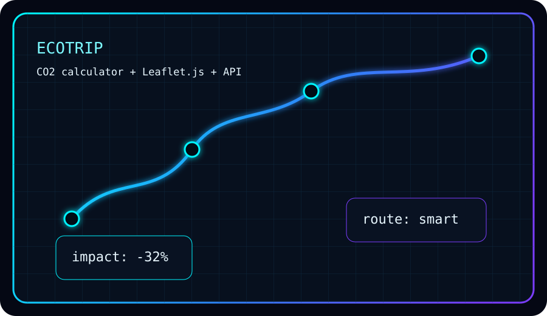
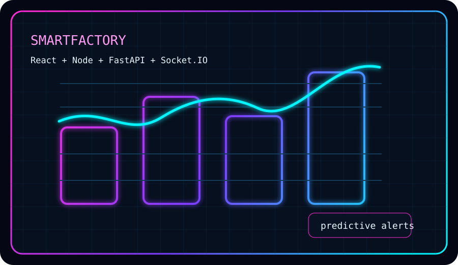
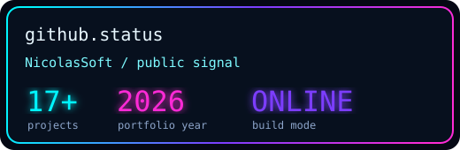
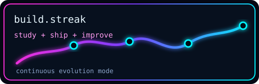

<div align="center">



<br />


<br />

<a href="https://nicolasdaniel.dev/">
  
</a>
<a href="https://github.com/NicolasSoft">
  
</a>
<a href="https://www.linkedin.com/in/nicolasdanielsantos">
  
</a>
<a href="mailto:nicolas.d.daniell@gmail.com">
  
</a>

</div>

<br />

<div align="center">
  
</div>

<br />

<div align="center">

<table>
  <tr>
    <td align="center" width="33%">
      <strong>17+</strong><br />
      projetos publicados
    </td>
    <td align="center" width="33%">
      <strong>3+</strong><br />
      anos estudando tecnologia
    </td>
    <td align="center" width="33%">
      <strong>24h</strong><br />
      resposta inicial
    </td>
  </tr>
</table>

</div>

<div align="center">

<table>
  <tr>
    <td align="left" width="58%">

<pre><code class="language-ts">const nicolas = {
  name: "Nicolas Daniel",
  alias: "NicolasDevs",
  location: "Campinas, SP",
  role: "Full Stack Developer & Cybersecurity",
  orbit: ["Cloud", "IoT", "AIoT", "AWS"],
  mission: "transformar ideias complexas em produtos reais",
};</code></pre>

  </td>
  <td align="left" width="42%">

<strong>n-terminal</strong>

<pre><code class="language-bash">&gt; boot portfolio
&gt; scan projects --featured
&gt; load neonforge
&gt; deploy impact</code></pre>

  </td>
  </tr>
</table>

</div>

<div align="center">


</div>

---

<h2 align="center">forge room</h2>

<div align="center">

<table>
  <tr>
    <td align="center" width="25%">
      <strong>Web Dev</strong><br />
      interfaces responsivas, produtos full stack e experiencias com cara de sistema vivo.
    </td>
    <td align="center" width="25%">
      <strong>Cybersecurity</strong><br />
      boas praticas, seguranca digital, arquitetura defensiva e cuidado desde o inicio.
    </td>
    <td align="center" width="25%">
      <strong>Cloud & DevOps</strong><br />
      AWS, Docker, automacoes, APIs e bases prontas para crescer com confianca.
    </td>
    <td align="center" width="25%">
      <strong>IA & Dados</strong><br />
      machine learning, GenAI, dashboards, automacao e solucoes orientadas a impacto.
    </td>
  </tr>
</table>

</div>

<h2 align="center">featured projects</h2>

<div align="center">

<table>
  <tr>
    <td align="center" width="50%">
      <a href="https://github.com/NicolasSoft/NEXUS-INDUSTRIAL-INTELLIGENCE-PLATFORM.git">
        
      </a>
      <br />
      <strong>NeonForge</strong><br />
      IoT + IA + Cybersecurity para monitoramento industrial em tempo real com FastAPI, Docker, JWT, TensorFlow e WebSocket.
    </td>
    <td align="center" width="50%">
      <a href="https://github.com/NicolasSoft/Agro-Mind---Hackaton.git">
        
      </a>
      <br />
      <strong>AgroMind AI</strong><br />
      plataforma full stack com IoT, visao computacional e IA generativa. Projeto do Low Hack, 2 lugar.
    </td>
  </tr>
  <tr>
    <td align="center" width="50%">
      <a href="https://github.com/NicolasSoft/EcoTrip-Calculadora-Inteligente-de-Impacto-Ambiental.git">
        
      </a>
      <br />
      <strong>EcoTrip</strong><br />
      calculadora inteligente de impacto ambiental com API, Leaflet.js e visualizacoes educativas.
    </td>
    <td align="center" width="50%">
      <a href="https://github.com/NicolasSoft/Smart-Factory.git">
        
      </a>
      <br />
      <strong>SmartFactory Insight</strong><br />
      plataforma Industria 4.0 com React, Node, FastAPI, PostgreSQL, Socket.IO e analise preditiva.
    </td>
  </tr>
</table>

</div>

<h2 align="center">mission log</h2>

<div align="center">

<table>
  <tr>
    <td align="center">
      <strong>IFSP Campinas</strong><br />
      ADS, engenharia de software e construcao de solucoes digitais.
    </td>
    <td align="center">
      <strong>Microcamp</strong><br />
      tecnico em informatica, hardware, software, redes e base pratica.
    </td>
    <td align="center">
      <strong>Voluntariado IFSP</strong><br />
      suporte tecnico, laboratorios e pequenos sistemas para projetos academicos.
    </td>
  </tr>
</table>

</div>

<h2 align="center">certification grid</h2>

<div align="center">


</div>

---

<h2 align="center">signal board</h2>

<div align="center">




<br />



</div>

<h2 align="center">neonforge protocol</h2>

```txt
01. imagine uma tela que parece trailer
02. remova tudo que nao ajuda o usuario
03. deixe seguranca, performance e UX orbitarem o mesmo nucleo
04. teste, lapide, publique
05. repita ate parecer inevitavel
```

<div align="center">

<a href="https://nicolasdaniel.dev/">
  
</a>
<a href="https://codepen.io/NicolasSoft">
  
</a>
<a href="https://www.instagram.com/nicolasdaniel_tech">
  
</a>

<br />


</div>
